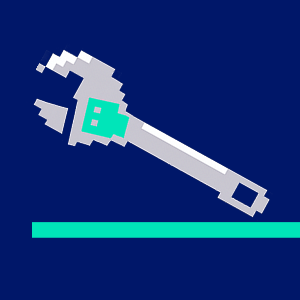

# n-dx

AI-powered development toolkit. Three packages that chain together: analyze a codebase, build a PRD, execute tasks autonomously.

| | | |
|:---:|:---:|:---:|
| [](packages/sourcevision) | [](packages/rex) | [](packages/hench) |
| **[SourceVision](packages/sourcevision)** | **[Rex](packages/rex)** | **[Hench](packages/hench)** |
| Static analysis & zone detection | PRD management & task tracking | Autonomous agent execution |

## Quick Start

```sh
pnpm install
pnpm build

# Register CLI globally
npm link
# or
pnpm link --global

# Initialize all tools in a project
ndx init .

# Analyze codebase and generate PRD proposals
ndx plan .

# Accept proposals into the PRD
ndx plan --accept .

# Execute the next task autonomously
ndx work .

# Check progress
ndx status .
```

## Packages

**[sourcevision](packages/sourcevision)** — Static analysis: file inventory, import graph, zone detection (Louvain community detection), React component catalog. Produces `.sourcevision/CONTEXT.md` and `llms.txt` for AI consumption. Includes an interactive browser-based viewer.

**[rex](packages/rex)** — PRD management: hierarchical epics/features/tasks/subtasks, `analyze` scans project + sourcevision output to generate proposals, `status` shows completion tree. Stores state in `.rex/prd.json`. MCP server for AI tool integration.

**[hench](packages/hench)** — Autonomous agent: picks next rex task, builds a brief, calls Claude API or CLI in a tool-use loop with security guardrails, records runs in `.hench/runs/`.

## Command Aliases

Both `n-dx` and `ndx` work identically. Examples in this doc use `ndx` for brevity.

| Full Form | Short Form |
|-----------|------------|
| `n-dx` | `ndx` |
| `sourcevision` | `sv` |

## Orchestration Commands

```
ndx init [dir]             sourcevision init + rex init + hench init
ndx plan [dir]             sourcevision analyze + rex analyze (show proposals)
ndx plan --accept [dir]    ...then accept proposals into PRD
ndx plan --file=<path>     import PRD from a document (skips sourcevision)
ndx work [dir]             hench run (interactive task selection by default)
ndx work --auto [dir]      autoselect highest-priority task
ndx work --iterations=N    run N tasks sequentially (stops on failure)
ndx status [dir]           rex status (pass --format=json)
```

## Direct Tool Access

Access individual tools through the orchestrator or as standalone commands:

```sh
# Via orchestrator (ndx delegates to the tool)
ndx rex <command> [args]
ndx hench <command> [args]
ndx sourcevision <command> [args]
ndx sv <command> [args]           # shorthand for sourcevision

# Standalone binaries (also available after npm link)
rex <command> [args]
hench <command> [args]
sourcevision <command> [args]
sv <command> [args]               # shorthand for sourcevision
```

## MCP Servers

Rex and sourcevision expose MCP servers for Claude Code tool use:

```sh
# Using standalone binaries (recommended)
claude mcp add rex -- rex mcp .
claude mcp add sourcevision -- sv mcp .

# Or using node directly
claude mcp add rex -- node packages/rex/dist/cli/index.js mcp .
claude mcp add sourcevision -- node packages/sourcevision/dist/cli/index.js mcp .
```

## Development

```sh
pnpm build          # build all packages
pnpm test           # test all packages
pnpm typecheck      # typecheck all packages
```

## Output Files

| Directory | Owner | Contents |
|-----------|-------|----------|
| `.sourcevision/` | sourcevision | `manifest.json`, `inventory.json`, `imports.json`, `zones.json`, `components.json`, `llms.txt`, `CONTEXT.md` |
| `.rex/` | rex | `prd.json`, `config.json`, `execution-log.jsonl`, `workflow.md` |
| `.hench/` | hench | `config.json`, `runs/` |

## License

ISC
