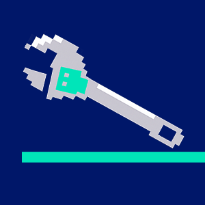

# n-dx

[](https://socket.dev/npm/package/@n-dx/core)

AI-powered development toolkit. Analyze a codebase, build a PRD, execute tasks autonomously.

| | | |
|:---:|:---:|:---:|
| [](packages/sourcevision) | [](packages/rex) | [](packages/hench) |
| **[SourceVision](packages/sourcevision)** | **[Rex](packages/rex)** | **[Hench](packages/hench)** |
| Static analysis & zone detection | PRD management & task tracking | Autonomous agent execution |

## Quick Start / Try the Sample App

Want to explore `n-dx` features in a safe, sandboxed environment? You can generate a sample web application complete with a pre-populated `.rex` PRD tree.

```sh
ndx install-sample .
ndx start .
```

Open the dashboard (default `http://localhost:3117`) to explore the generated PRD items, view codebase analysis, and use the autonomous agent to fix bugs in the sample app.

When you're done, you can cleanly remove the sample app and its PRD items:
```sh
ndx destroy-sample .
```
*(You can also install and destroy the sample app directly from the Commands view in the dashboard).*

## Requirements

**Node.js ≥ 22** (22 LTS recommended) · **pnpm ≥ 10**

### Platform Support

| Platform | Support | Notes |
|----------|---------|-------|
| macOS | ✅ Supported | CI smoke tests on `macos-latest` |
| Linux | ✅ Supported | Full CI (build, typecheck, unit tests) on `ubuntu-latest` |
| Windows — WSL2 | ✅ Supported | Runs as Linux; no separate CI coverage needed |
| Windows — native | ⚠️ Experimental | CLI smoke tests pass in CI with macOS parity checks; process group management and shell spawning differ from POSIX; `ndx work` agent loop has reduced native test coverage |

For a supported Linux environment on Windows, use **WSL2** (recommended) or the Docker infrastructure in [`.local_testing/`](.local_testing/).

## Local Platform Testing

If you're on **native Windows** or want to test against multiple platforms, use the Docker-based local test suite:

### Prerequisites

- **Docker Desktop** ≥ 20 (download from [docker.com](https://www.docker.com/products/docker-desktop))
- **Disk space:** ~2GB for Windows Server Core image; Linux image is smaller
- **Docker daemon must be running** before starting tests

### Quick Test

Run tests in an isolated environment matching native Windows or macOS:

**macOS / Linux (bash):**
```sh
./.local_testing/run-gauntlet.sh
```

**Windows (PowerShell):**
```powershell
.\.local_testing\run-gauntlet.ps1
```

Both scripts:
- Detect your platform automatically
- Build the Docker image (cached after first run)
- Run `pnpm test` inside the container
- Clean up automatically on completion
- Return meaningful exit codes

### Exit Codes

- **0** — All tests passed ✓
- **1** — Tests failed (one or more test case failed)
- **2** — Docker error (build, run, or daemon issue)
- **3** — Configuration error (Docker not found, invalid options)

### Advanced Options

See [`.local_testing/README.md`](.local_testing/) for advanced usage:
- Custom image tags and container names
- Keeping containers for inspection (`--keep-container`)
- Background execution (`--detach`)
- Verbose debugging (`--verbose`)
- CI/CD pipeline integration examples
- Troubleshooting Docker and container issues

## Quick Start

**Prerequisites:** Node.js ≥ 22 (22 LTS recommended).

**Recommended:** install `@n-dx/core` globally with npm.

```sh
npm install -g @n-dx/core
```

Alternatives: `pnpm add -g @n-dx/core` (equivalent), or `yarn global add @n-dx/core`
(best-effort, untested). For one-off use without a global install, run
`npx -p @n-dx/core ndx <command>` — bare `npx @n-dx/core` does not work.
See [Install Path Validation](docs/process/install-path-validation.md) for the tested-behavior rationale.

**Upgrading:** always pass an explicit `@latest` tag — `npm i -g @n-dx/core@latest`
or `pnpm add -g @n-dx/core@latest`. While the project is on 0.x, a bare upgrade
re-resolves inside the caret range recorded at install time (`^0.3.1` means
`>=0.3.1 <0.4.0`), so it cannot cross a minor boundary. Upgrade with the same
package manager you installed with; see
[Troubleshooting](docs/guide/troubleshooting.md) if `ndx --version` does not change.

Then run:

```sh
ndx init .                  # initialize project (.sourcevision/.rex/.hench)
ndx config llm.vendor claude .

ndx analyze .               # run SourceVision codebase analysis
ndx recommend --accept .    # turn findings into PRD tasks
ndx add "Add SSO support" . # add custom feature requests
ndx work --auto .           # execute the next task autonomously
ndx status .                # check progress
```

## Workflow

The core loop: **analyze** your codebase, **build** a PRD from findings and ideas, **execute** tasks with an autonomous agent.

### 1. Analyze

```sh
ndx analyze .
```

Runs SourceVision static analysis: file inventory, import graph, zone detection (Louvain community detection), and React component catalog. Outputs `.sourcevision/CONTEXT.md`, `llms.txt`, zones, and architectural findings.

### 2. Recommend

```sh
ndx recommend .                # show findings and recommendations
ndx recommend --accept .       # add all recommendations to PRD
ndx recommend --acknowledge=1,2 .  # skip specific findings
ndx recommend --actionable-only .  # only anti-patterns, suggestions, move-files
```

Translates SourceVision findings into concrete PRD tasks. The `--actionable-only` flag filters out non-actionable observations (metrics, patterns, relationships) and keeps only findings that describe concrete problems to fix.

### 3. Add Ideas

```sh
ndx add "Add SSO support with Google and Okta" .    # natural language
ndx add --file=ideas.txt .                           # import from file
```

Smart add uses an LLM to decompose descriptions into structured epic/feature/task proposals with duplicate detection against existing PRD items.

### 4. Plan (Full Pipeline)

```sh
ndx plan .                  # analyze + generate PRD proposals (interactive)
ndx plan --accept .         # analyze + auto-accept proposals
ndx plan --file=spec.md .   # import PRD from a document (skips analysis)
```

`plan` combines analysis and proposal generation in one step. For existing codebases scanned for the first time, baseline detection automatically marks implemented functionality as "completed" and only gaps/improvements as "pending."

### 5. Execute

```sh
ndx work --auto .                          # next highest-priority task
ndx work --auto --iterations=4 .           # run 4 tasks sequentially
ndx work --epic="Auth System" --auto .     # scope to an epic
ndx work --task=abc123 .                   # specific task
ndx work --auto --yes .                    # unattended: auto-confirm commit + rollback prompts
```

Hench picks a task, builds a brief with codebase context, runs an LLM tool-use loop to implement it, then records the run. Pass `--yes` to skip the interactive commit-confirmation prompt (the agent's proposed message is committed automatically).

### 6. Self-Heal

```sh
ndx self-heal 3 .           # 3 iterations of analyze → recommend → execute
ndx self-heal 3 --yes .     # unattended: forward --yes to the inner hench loop
```

Iterative improvement loop: re-analyze the codebase, accept new recommendations (filtered to actionable findings), execute tasks, acknowledge completed findings, and repeat. Fuzzy acknowledgment matching prevents fixed findings from regenerating as "new" after code changes alter zone names.

### 7. Monitor

```sh
ndx status .                # PRD tree with completion stats
ndx start .                 # dashboard + MCP server (port 3117)
ndx start --background .    # daemon mode
ndx usage .                 # token usage analytics
```

## LLM Configuration

**Claude (recommended):**
```sh
ndx config llm.vendor claude .
# API mode (recommended):
ndx config llm.claude.api_key sk-ant-... .
# CLI mode (no API key):
ndx config llm.claude.cli_path claude .
```

**Codex:**
```sh
ndx config llm.vendor codex .
ndx config llm.codex.cli_path codex .
```

## Commands

### Primary

| Command | Description |
|---------|-------------|
| `ndx init [dir]` | Initialize all tools (sourcevision + rex + hench) |
| `ndx analyze [dir]` | Run SourceVision codebase analysis (`--deep`, `--full`, `--lite`) |
| `ndx recommend [dir]` | Show/accept SourceVision recommendations (`--accept`, `--actionable-only`) |
| `ndx add "<desc>" [dir]` | Add PRD items from descriptions, files, or stdin |
| `ndx work [dir]` | Run next task (`--task=ID`, `--epic=ID`, `--auto`, `--loop`, `--yes`) |
| `ndx self-heal [N] [dir]` | Iterative improvement loop (analyze + recommend + execute) |
| `ndx start [dir]` | Start server: dashboard + MCP (`--port=N`, `--background`, `stop`, `status`) |

### More

| Command | Description |
|---------|-------------|
| `ndx plan [dir]` | Analyze codebase and generate PRD proposals (`--guided`, `--accept`) |
| `ndx status [dir]` | Show PRD status (`--format=json`, `--since`, `--until`) |
| `ndx refresh [dir]` | Refresh dashboard artifacts (`--ui-only`, `--data-only`, `--no-build`) |
| `ndx usage [dir]` | Token usage analytics (`--format=json`, `--group=day\|week\|month`) |
| `ndx sync [dir]` | Sync local PRD with remote adapter (`--push`, `--pull`) |
| `ndx dev [dir]` | Start dev server with live reload |
| `ndx ci [dir]` | Run analysis pipeline and validate PRD health |
| `ndx config [key] [value]` | View and edit settings (`--json`, `--help`) |
| `ndx export [dir]` | Export static deployable dashboard (`--out-dir`, `--deploy=github`) |
| `ndx auth [dir]` | Check and configure LLM provider credentials |
| `ndx web [dir]` | Dashboard server control (lower-level counterpart to `ndx start`) |
| `ndx install-sample [dir]` | Install the sandboxed sample app and its PRD items |
| `ndx destroy-sample [dir]` | Remove the sample app and its PRD items |
| `ndx pair-programming "<desc>" [dir]` | Run two vendors against one task, primary + reviewer |
| `ndx bicker [dir]` | Adversarial cross-vendor review of a change |
| `ndx reset [dir]` | Remove `.sourcevision/` and start fresh |

### PRD management

These are delegated to rex; `ndx <command>` and `rex <command>` are equivalent.

| Command | Description |
|---------|-------------|
| `ndx next [dir]` | Print the next actionable task |
| `ndx tree [dir]` | Show the full PRD hierarchy with colour-coded status |
| `ndx update <id> [dir]` | Update item status, priority, or title |
| `ndx remove <id> [dir]` | Remove an item and its children |
| `ndx move <id> [dir]` | Reparent an item under a new parent |
| `ndx reshape [dir]` | LLM-powered PRD restructuring (merge, split, regroup) |
| `ndx reorganize [dir]` | Detect and fix structural issues |
| `ndx prune [dir]` | Remove completed subtrees (archived to `.rex/archive.json`) |
| `ndx validate [dir]` | Check PRD integrity (DAG, schema) |
| `ndx fix [dir]` | Auto-fix common PRD issues |
| `ndx health [dir]` | PRD structure health score |
| `ndx report [dir]` | Generate a JSON health report |
| `ndx verify [dir]` | Run tests mapped to acceptance criteria |
| `ndx show <run-id> [dir]` | Show full details of a hench run |

Run `ndx <command> --help` for full flags on any command, or `ndx help <keyword>`
to search. `ndx --help` lists everything.

### Direct Tool Access

```sh
ndx rex <command> [args]          # or standalone: rex <command> [args]
ndx hench <command> [args]        # or standalone: hench <command> [args]
ndx sourcevision <command> [args] # or standalone: sv <command> [args]
```

Both `n-dx` and `ndx` work identically. `sv` is an alias for `sourcevision`.

## MCP Servers

Rex and SourceVision expose MCP servers for any MCP-compatible assistant (Claude Code, Codex, etc.).

### HTTP transport (recommended)

```sh
ndx start .
# Claude example:
claude mcp add --transport http rex http://localhost:3117/mcp/rex
claude mcp add --transport http sourcevision http://localhost:3117/mcp/sourcevision
```

### stdio transport

`ndx init` auto-registers stdio MCP servers for both Claude Code and Codex. After init, MCP works out of the box.

Manual Claude registration:

```sh
claude mcp add rex -- rex mcp .
claude mcp add sourcevision -- sv mcp .
```

Codex reads `.codex/config.toml` automatically — no manual registration required.

### Tools

**Rex:** `get_prd_status`, `get_next_task`, `add_item`, `update_task_status`, `edit_item`, `get_item`, `move_item`, `merge_items`, `get_recommendations`, `verify_criteria`, `reorganize`, `health`, `facets`, `append_log`, `sync_with_remote`, `get_capabilities`

**SourceVision:** `get_overview`, `get_next_steps`, `get_zone`, `get_findings`, `get_file_info`, `search_files`, `get_imports`, `get_classifications`, `set_file_archetype`, `get_route_tree`

## Packages

| Package | Description |
|---------|-------------|
| **[@n-dx/sourcevision](packages/sourcevision)** | Static analysis: file inventory, import graph, zone detection (Louvain), React component catalog. Produces `.sourcevision/CONTEXT.md` and `llms.txt`. |
| **[@n-dx/rex](packages/rex)** | PRD management: hierarchical epics/features/tasks/subtasks, LLM-powered analysis and recommendations. Stores state in `.rex/prd_tree/` (slug-based folder tree). |
| **[@n-dx/hench](packages/hench)** | Autonomous agent: picks rex tasks, builds briefs, runs LLM tool-use loops with security guardrails. Records runs in `.hench/runs/`. |
| **[@n-dx/llm-client](packages/llm-client)** | Vendor-neutral LLM foundation: Claude and Codex adapters, provider registry, token usage tracking. |
| **[@n-dx/web](packages/web)** | Dashboard and unified MCP HTTP server: browser-based project dashboard with zone maps and PRD status. |

## Output Files

| Directory | Owner | Contents |
|-----------|-------|----------|
| `.sourcevision/` | sourcevision | `manifest.json`, `inventory.json`, `imports.json`, `zones.json`, `components.json`, `llms.txt`, `CONTEXT.md` |
| `.rex/` | rex | `prd_tree/` (folder tree), `config.json`, `execution-log.jsonl`, `workflow.md`, `acknowledged-findings.json` |
| `.hench/` | hench | `config.json`, `runs/` |

> **Legacy PRD migration.** If upgrading from a previous layout using `.rex/prd.md` (flat Markdown) or `.rex/prd.json`, run `rex migrate-to-folder-tree` to convert to the folder tree format. The command optionally deletes the legacy source file after migration. See the [rex README](packages/rex) for details.

### The PRD, by example

n-dx manages its own PRD with n-dx, so this repository doubles as a reference
for the format. Read these two together — they are the same project at both
ends of the workflow:

| Artifact | What it is |
|----------|-----------|
| [`prd.md`](prd.md) | The hand-written v1 spec that seeded the project. This is what a human writes, and the shape `ndx add --file=` / `ndx plan --file=` expect when importing an existing document. |
| [`.rex/prd_tree/`](.rex/prd_tree) | The live, tool-managed tree — slug-named folders with YAML front-matter, generated child tables, and status the agent reads and updates as it works. |

You interact with the tree through `ndx status` / `ndx tree` / `ndx next` /
`ndx add` / `ndx work`, through the rex MCP tools from an assistant session, or
by editing the Markdown directly — it is a normal git surface, so diffs and
review work as usual. The [PRD storage layout guide](docs/guide/prd-storage.md)
explains the rules the tree follows and when each surface is appropriate.

## .gitignore Setup

After `ndx init`, add the following block to your `.gitignore` before the first commit — ephemeral agent runs, caches, and PID files should not be tracked:

```gitignore
# n-dx runtime artifacts — keep .rex/prd_tree/ .rex/config.json .hench/config.json CLAUDE.md AGENTS.md
.sourcevision/
.hench/runs/
.hench/locks/
.hench-commit-msg.txt
.rex/.backups/
.rex/.cache/
.rex/prd.json.lock
.rex/pending-proposals.json
.rex/acknowledged-findings.json
.rex/execution-log*.jsonl
.rex/adapters.json
.rex/n-dx_workflow.md
.n-dx-web.pid
.n-dx-web.port
.run-logs/
.n-dx.local.json
*.local.json
.claude/settings.local.json
```

Remove `.sourcevision/` if you want to commit the analysis baseline so teammates skip a re-analysis pass. See the [.gitignore reference](https://n-dx.dev/guide/gitignore) for the full explanation of each path and a template file at [`packages/core/assistant-assets/ndx.gitignore`](packages/core/assistant-assets/ndx.gitignore).

## Security

n-dx runs an autonomous agent (hench) that reads, writes, and executes commands on your behalf. The security model is designed to keep all operations scoped to the project directory with no ambient access to the rest of your system.

### Filesystem boundary

Every file operation passes through a guard that validates the resolved path stays within the project directory. Directory traversal (`..`), null-byte injection, and symlink escapes are rejected before any I/O occurs. Additionally, `.hench/`, `.rex/`, `.git/`, and `node_modules/` are blocked by default — the agent cannot modify its own configuration or PRD state through file tools.

### Shell execution

Shell commands are restricted to an allowlist of executables: `npm`, `npx`, `node`, `git`, `tsc`, `vitest` by default. Shell metacharacters (`;`, `&`, `|`, `` ` ``, `$`) are rejected outright to prevent command injection. Git subcommands are separately allowlisted — `push`, `reset`, `clean`, `fetch`, and `rebase` are blocked by default. Dangerous patterns (`sudo`, `chmod 777`, `rm` with absolute paths, `eval`) are caught even for allowed executables.

### Network access

The only outbound network connections are to the configured LLM API (Anthropic by default) through `@n-dx/llm-client`. No other HTTP clients, fetch calls, or socket connections exist in the agent runtime.

### Rate limiting

A policy engine enforces per-minute rate limits on commands (60/min) and file writes (30/min). Cumulative budgets for total bytes written and total commands are configurable in `.hench/config.json` under `guard.policy`.

### No install-time hooks

All packages use only `prepare` scripts (TypeScript compilation). There are no `preinstall`, `postinstall`, or native code compilation steps.

### Obfuscated code policy

`pnpm security:obfuscation` scans repository source and installed `node_modules` packages for obfuscation patterns such as eval-packed payloads, generated `_0x` dispatcher clusters, encoded dynamic loaders, and JSFuck-style encodings. The check runs in CI, release, and local preflight so unreadable payloads cannot be introduced through source changes or dependency updates.

### Configuration

Guard settings are loaded once per agent run and cannot be modified mid-execution. All defaults are restrictive — you can loosen them in `.hench/config.json` under `guard`, but the agent itself cannot write to that file.

See the [hench README](packages/hench#security) for the full configuration reference.

## Contributing

See [CONTRIBUTING.md](CONTRIBUTING.md) for the full contributor setup guide,
including Node.js / pnpm version requirements, workspace bootstrap, platform-
specific notes (macOS, Linux, Windows/WSL2), and Docker testing infrastructure.

Quick start:

```sh
git clone https://github.com/en-dash-consulting/n-dx.git
cd n-dx
pnpm install && pnpm build
```

### Build & test

```sh
pnpm build          # build all packages
pnpm test           # test all packages
pnpm typecheck      # typecheck all packages
```

### Issue triage

The `/triage` skill in Claude Code prioritizes and reprioritizes GitHub issues against strategic goals. See `.claude/skills/triage/` for the goals matrix and process.

### Resources

See [PACKAGE_GUIDELINES.md](PACKAGE_GUIDELINES.md) for package conventions, gateway patterns, and dependency hierarchy. See [TESTING.md](TESTING.md) for test tier requirements. See [OPEN_SOURCE_SCOPE.md](OPEN_SOURCE_SCOPE.md) for licensing boundaries, included/excluded components, and contribution expectations.

## Community

Please read our [Code of Conduct](CODE_OF_CONDUCT.md) before participating.

## License

[Elastic License 2.0](LICENSE)
