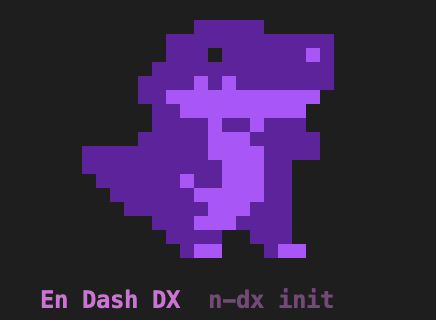
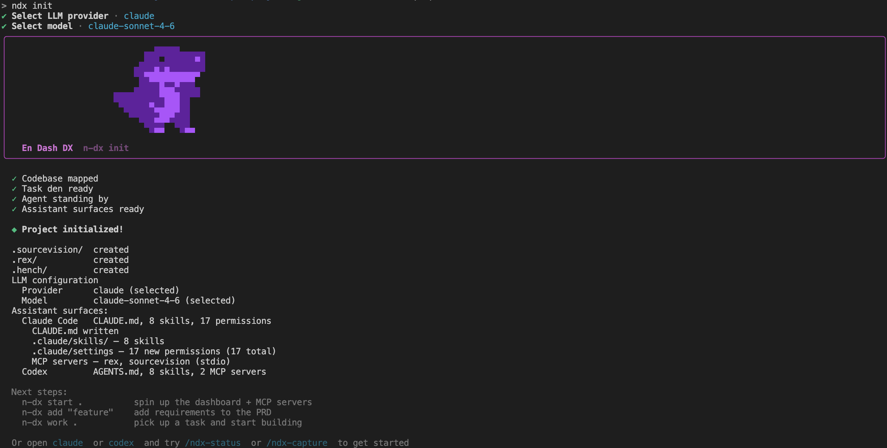
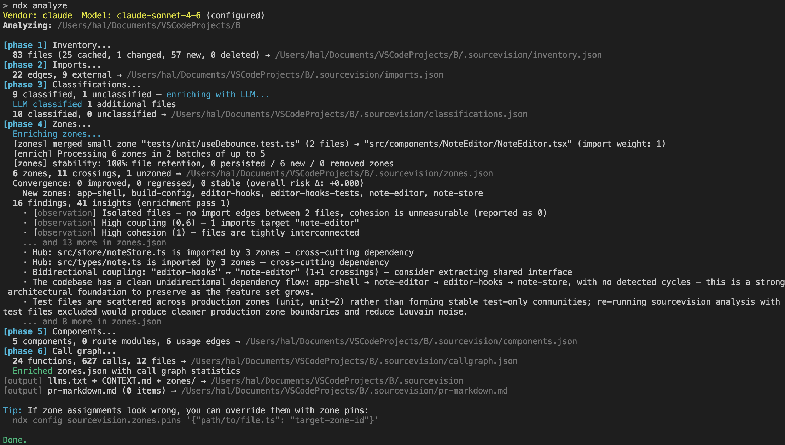
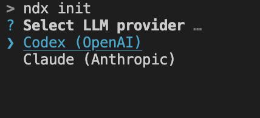
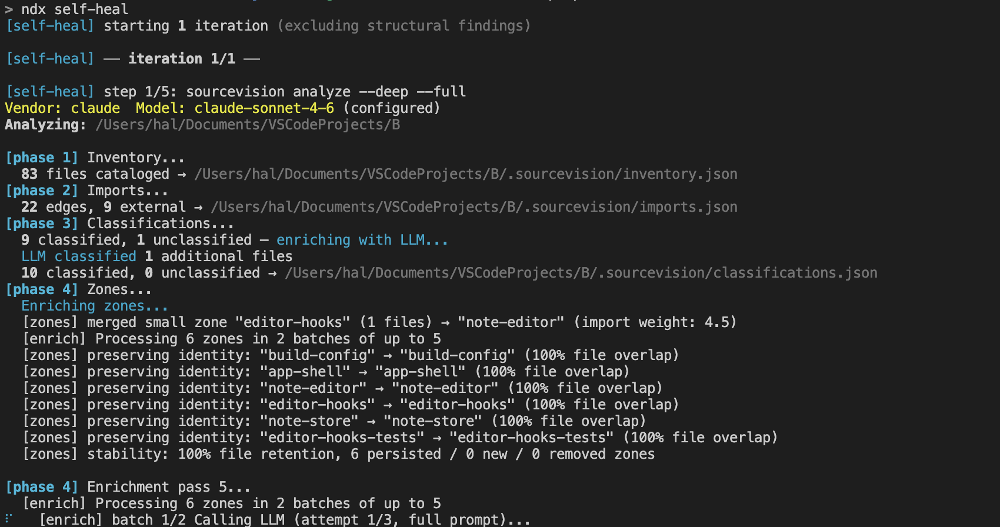
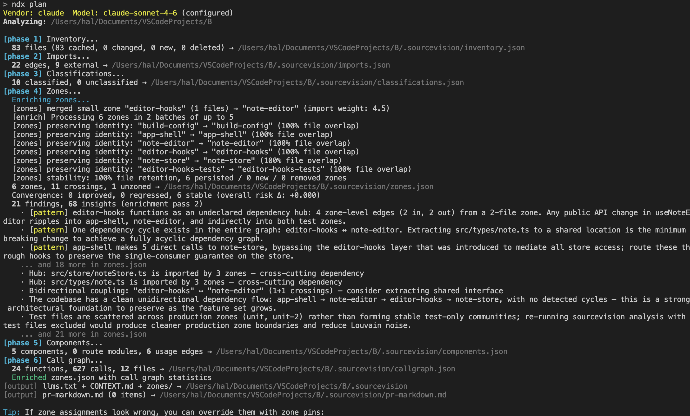
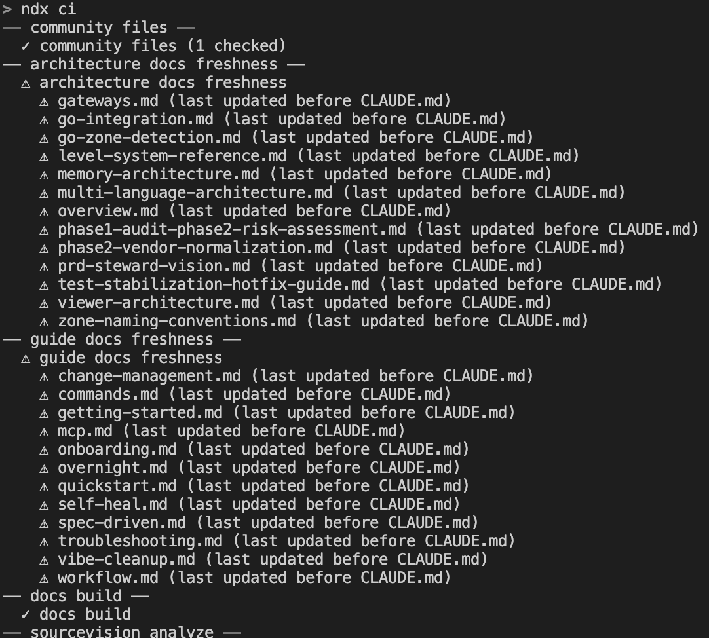
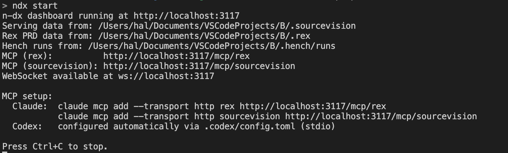

# Existing project onboarding



You have a real codebase with real history. This guide adds ndx without touching your code, gets a baseline of architectural findings, lets you triage them, sets up `.gitignore` so ephemeral state stays out of git, and *then* generates a PRD scoped to what actually matters — instead of bulk-importing every finding into a noisy backlog.

::: tip Starting from scratch?
If your project is brand new or empty, use the [Quickstart](./quickstart) instead. It's the same flow without the cleanup pass.
:::

## Prerequisites

- **Node.js ≥ 18** (Node 22 LTS recommended)
- **pnpm ≥ 10** — [install pnpm](https://pnpm.io/installation)
- **A clean working tree.** Commit or stash any in-progress work first — `ndx init` writes new files at the repo root and inside a few dot-directories.

## 1. Install

```sh
pnpm add -g @n-dx/core
```

## 2. Initialize — but don't commit yet

```sh
ndx init .
```



You'll be asked to choose an LLM provider (Claude or Codex). By default both surfaces are provisioned. Use `--claude-only` or `--codex-only` to limit to one assistant.

Init creates analysis metadata, PRD storage, agent configuration, and assistant-specific artifacts:

- **Claude**: `CLAUDE.md`, `.claude/skills/`, `.claude/settings.local.json`, MCP server registration
- **Codex**: `AGENTS.md`, `.agents/skills/`, `.codex/config.toml`

Init also adds `.n-dx.local.json` to your `.gitignore` automatically — but that's the *only* ndx path it gitignores. The rest you'll add yourself in Step 4 before any commit.

::: warning Don't commit yet
Resist the urge to `git add .` here. Several files ndx just produced are ephemeral or local-only. Commit after Step 4.
:::

## 3. Pre-flight analysis (read-only)

Get an architectural baseline before ndx writes anything to your PRD:

```sh
ndx analyze .
```



Analyze writes only to `.sourcevision/` — file inventory, import graph, zones, findings. No PRD changes yet. Then read what it found:

```sh
ndx recommend --actionable-only .
```



Skim `.sourcevision/CONTEXT.md` for the AI-readable summary, and use the recommend output to see what ndx thinks needs work. The goal here is a mental model — you don't need to act on anything yet.

## 4. `.gitignore` basics

**Do this before your first ndx-related commit.** Without these entries, ephemeral runs, locks, caches, and PID files will end up in version control and create noise on every diff.

See [.gitignore for ndx projects](./gitignore) for the full reference — what each path contains and why it should be ignored. The copy-pasteable snippet from that page:

```gitignore
# n-dx — runtime artifacts and ephemeral state
# Keep: .rex/prd_tree/ .rex/config.json .hench/config.json CLAUDE.md AGENTS.md
# Optional: .sourcevision/ (shared analysis baseline) .n-dx.json (project config)

# Analysis output (regenerated by `ndx analyze`)
.sourcevision/

# Agent runs, locks, and session state
.hench/runs/
.hench/locks/
.hench-commit-msg.txt

# Rex ephemeral state
.rex/.backups/
.rex/.cache/
.rex/prd.json.lock
.rex/pending-proposals.json
.rex/acknowledged-findings.json
.rex/execution-log*.jsonl
.rex/adapters.json
.rex/n-dx_workflow.md

# Server runtime
.n-dx-web.pid
.n-dx-web.port

# Run logs
.run-logs/

# Local config overrides (may contain secrets or API keys)
.n-dx.local.json
*.local.json

# Assistant local settings (personal, not shared)
.claude/settings.local.json
```

If you want to commit `.sourcevision/` as a shared analysis baseline (so teammates skip a re-analysis pass), remove that line. See the [gitignore guide](./gitignore#what-to-commit-vs-what-to-ignore) for the full commit/ignore decision table.

Now run `git status` to confirm only the files you want are staged, then commit the init baseline (without a PRD yet):

```sh
git add .gitignore .sourcevision/ .rex/config.json .hench/config.json CLAUDE.md AGENTS.md
git commit -m "chore: add n-dx baseline (sourcevision + config)"
```

## 5. Pre-emptive self-heal (optional, recommended for older repos)

A self-heal pass *before* PRD generation lets ndx fix the mechanical findings it already knows how to fix — circular dependencies, unused exports, simple anti-patterns — so your PRD doesn't fill up with grunt work.

```sh
ndx self-heal 1 . --yes
```



The argument (`1`) is the iteration count. Each iteration runs `analyze → recommend → accept → execute → acknowledge`, and a regression guard aborts the loop if circular deps or total code-health issues *increase*. For a deeper pass:

```sh
ndx self-heal 3 .
```

**When to skip this step:**
- The repo is small or the findings list is already tiny
- You want to review every code change manually before it lands

**When to go further instead:**
- The codebase is genuinely messy or prototype-quality → see [Cleaning Up a Vibe-Coded App](./vibe-cleanup) for a heavier remediation flow

## 6. Triage findings before generating the PRD

Acknowledge findings you don't intend to fix — intentional architectural choices, work that's already on someone else's plate, or anything outside your team's scope. Acknowledged findings persist in `.rex/acknowledged-findings.json` (gitignored — these are personal triage notes) and won't regenerate on the next analyze.

```sh
ndx recommend --actionable-only --acknowledge .
```

For the lifecycle details (fuzzy matching, regeneration rules, un-acknowledging), see [Self-Heal Loop](./self-heal).

## 7. Generate the PRD — review, don't blanket-accept

```sh
ndx plan .
```



**Do not pass `--accept` here.** The blank-project Quickstart uses `--accept` because there's no existing context to filter against; on an existing repo it's a recipe for a noisy backlog. The default flow is interactive — review each proposal and accept only what fits your roadmap. Anything you don't review is cached in `.rex/pending-proposals.json` and you can revisit it later with `rex analyze --accept`.

The accepted items land in `.rex/prd_tree/` as a slug-named folder hierarchy (one directory per epic/feature/task, each with an `index.md`).

## 8. Validate and commit the PRD baseline

```sh
ndx ci .
```



`ndx ci` runs the docs, analysis, health, and PRD validation phases. A green run is a good signal that your integration is consistent — use it as the commit point for your initial PRD:

```sh
git add .rex/prd_tree/ .sourcevision/
git commit -m "chore: integrate n-dx (initial PRD + analysis baseline)"
```

## 9. Start the dashboard and hand off to the team

```sh
ndx start .
```



The dashboard runs at `http://localhost:3117` with interactive views of zones, PRD tree, and agent runs.

For teammates: after they pull the repo, they only need `pnpm add -g @n-dx/core` and `ndx start .` — no re-analysis, no re-init. The committed `.sourcevision/` and `.rex/prd_tree/` give them the same baseline you just built.

## What's next?

- **Build a mental model of the codebase**: [Codebase Onboarding](./onboarding) — using MCP tools and the dashboard to explore zones interactively
- **Heavier cleanup pass**: [Cleaning Up a Vibe-Coded App](./vibe-cleanup) — when the repo needs more than one self-heal iteration
- **Keep the PRD aligned over time**: [Change Management](./change-management) — drift detection, post-sprint pruning, sync with external trackers
- **The self-heal loop in depth**: [Self-Heal Loop](./self-heal) — finding lifecycle, fuzzy acknowledgment, regression guards
- **All commands and flags**: [Commands](./commands)
- **Day-to-day workflow**: [Workflow](./workflow)

## Skills used in this guide

Each skill below maps to a step in this guide. Edit the linked file in your project to customize that step's behavior in your assistant session.

| Skill | Source | Role in this guide |
|-------|--------|--------------------|
| `/ndx-zone` | [`.agents/skills/ndx-zone/SKILL.md`](./skills#ndx-zone) | Step 3: explores zone health metrics from the pre-flight analysis to identify highest-risk areas |
| `/ndx-plan` | [`.agents/skills/ndx-plan/SKILL.md`](./skills#ndx-plan) | Step 7: generates the initial PRD interactively, filtered by the findings you triaged in Step 6 |
| `/ndx-status` | [`.agents/skills/ndx-status/SKILL.md`](./skills#ndx-status) | Step 8: confirms PRD integrity after acceptance and before the first commit |
| `/ndx-config` | [`.agents/skills/ndx-config/SKILL.md`](./skills#ndx-config) | LLM setup: sets vendor, API key, model, and CLI path during init |
| `/ndx-work` | [`.agents/skills/ndx-work/SKILL.md`](./skills#ndx-work) | Post-onboarding: executes the first tasks from the accepted PRD |

Related guides: [Codebase Onboarding](./onboarding) (interactive zone exploration after the baseline is committed), [Cleaning Up a Vibe-Coded App](./vibe-cleanup) (heavier remediation when pre-flight findings are extensive), [Change Management](./change-management) (keeping the PRD aligned over time).

For the full skill inventory and customization guidance, see the [Skills Reference](./skills).
